<div align="center">
  
</div>

<div align="center">
  
</div>

---

<div align="center">
  
### 🌟 **Welcome to my GitHub profile!** 🌟

I'm a passionate **Frontend Developer** at **<span style="color: #FF6B6B;">Technovez</span>** since March 2024, dedicated to building clean, responsive, and scalable web applications that deliver exceptional user experiences.

</div>

---

<div align="center">
  
## 💼 **About Me**

<table>
<tr>
<td width="50%">

- 🔭 Currently working as a **Frontend Developer** at Technovez
- 🌱 Specializing in **Angular 16+** and modern frontend technologies
- 💡 Passionate about writing maintainable code and following best practices
- 🎯 Focused on creating user-centric solutions with performance optimization
- 📚 Continuously learning and exploring full-stack development

</td>
<td width="50%">

<div align="center">
  
```typescript
const raoHuzaifa = {
  name: "Rao Huzaifa",
  role: "Frontend Developer",
  company: "Technovez",
  location: "Pakistan",
  skills: ["Angular", "TypeScript", "JavaScript"],
  passion: "Building amazing user experiences",
  currentlyLearning: ["Full-stack Development"],
  funFact: "I love clean code and modern UI/UX"
};
```

</div>

</td>
</tr>
</table>

</div>

---

<div align="center">
  
## 🛠️ **Tech Stack**

### **🎨 Frontend Technologies**

<table>
<tr>
<td align="center" width="120">
  
  <br />
  <sub><b>Angular</b></sub>
</td>
<td align="center" width="120">
  
  <br />
  <sub><b>TypeScript</b></sub>
</td>
<td align="center" width="120">
  
  <br />
  <sub><b>JavaScript</b></sub>
</td>
<td align="center" width="120">
  
  <br />
  <sub><b>HTML5</b></sub>
</td>
<td align="center" width="120">
  
  <br />
  <sub><b>CSS3</b></sub>
</td>
<td align="center" width="120">
  
  <br />
  <sub><b>SCSS</b></sub>
</td>
</tr>
</table>

### **🎯 UI Libraries & Frameworks**

<table>
<tr>
<td align="center" width="120">
  
  <br />
  <sub><b>Tailwind CSS</b></sub>
</td>
<td align="center" width="120">
  
  <br />
  <sub><b>Angular Material</b></sub>
</td>
<td align="center" width="120">
  
  <br />
  <sub><b>PrimeNG</b></sub>
</td>
</tr>
</table>

### **⚡ State Management & Backend**

<table>
<tr>
<td align="center" width="120">
  
  <br />
  <sub><b>Node.js</b></sub>
</td>
<td align="center" width="120">
  
  <br />
  <sub><b>Express.js</b></sub>
</td>
<td align="center" width="120">
  
  <br />
  <sub><b>NestJS</b></sub>
</td>
<td align="center" width="120">
  
  <br />
  <sub><b>NgRx</b></sub>
</td>
</tr>
</table>

</div>

---

<div align="center">
  
## 🎯 **What I Do**

<table>
<tr>
<td width="33%" align="center">

### ⚡ **Dynamic UI Development**

Creating responsive and interactive user interfaces with Angular 16+

</td>
<td width="33%" align="center">

### 🔧 **Performance Optimization**

Implementing best practices for fast, efficient web applications

</td>
<td width="33%" align="center">

### 🎨 **Modern Styling**

Utilizing Tailwind CSS, SCSS, and component libraries for beautiful designs

</td>
</tr>
<tr>
<td width="33%" align="center">

### 📊 **State Management**

Managing complex application state with NgRx

</td>
<td width="33%" align="center">

### 🔌 **API Integration**

Seamless integration with backend services and APIs

</td>
<td width="33%" align="center">

### 📱 **Responsive Design**

Ensuring optimal experience across all devices

</td>
</tr>
</table>

</div>

---

<div align="center">
  
## 🌟 **Professional Highlights**

<table>
<tr>
<td width="50%">

### 💼 **Current Role**

**Frontend Developer** at Technovez  
_(March 2024 - Present)_

### 🚀 **Project Experience**

- Contributed to multiple **real-world projects**
- Focus on **scalability** and **performance**
- **User-centric solutions** approach

</td>
<td width="50%">

### 📈 **Specializations**

- **Angular 16+** ecosystem expertise
- Modern development practices
- **Full-stack development** learning

### 🎯 **Commitment**

- Clean, maintainable code
- Exceptional user experiences
- Continuous learning mindset

</td>
</tr>
</table>

</div>

---

<div align="center">
  
## 📊 **My Coding Journey**

<div align="center">
  
### 🎨 **My Coding Canvas**

```mermaid
graph TD
    A[🚀 Rao Huzaifa] --> B[💻 Frontend Developer]
    A --> C[🎯 Angular Specialist]
    A --> D[✨ Clean Code Enthusiast]

    B --> E[📱 Responsive Design]
    B --> F[⚡ Performance Optimization]
    B --> G[🎨 Modern UI/UX]

    C --> H[🔧 Angular 16+]
    C --> I[📊 NgRx State Management]
    C --> J[🎪 Component Architecture]

    D --> K[📝 Maintainable Code]
    D --> L[🔄 Best Practices]
    D --> M[🚀 Scalable Solutions]

    style A fill:#ff6b6b,stroke:#333,stroke-width:3px,color:#fff
    style B fill:#4ecdc4,stroke:#333,stroke-width:2px,color:#fff
    style C fill:#45b7d1,stroke:#333,stroke-width:2px,color:#fff
    style D fill:#96ceb4,stroke:#333,stroke-width:2px,color:#fff
```



</div>

<br>

<div align="center">
  
### 🔥 **Contribution Heatmap**

<table>
<tr>
<td width="100%" align="center">


</td>
</tr>
</table>

</div>

</div>

---

<div align="center">
  
## 🤝 **Let's Connect**

I'm always open to discussing new opportunities, collaborating on interesting projects, or sharing knowledge about frontend development!

<div style="display: flex; justify-content: center; gap: 20px; flex-wrap: wrap; margin: 30px 0;">
  
<div style="background: linear-gradient(135deg, #0077B5, #005885); padding: 15px 25px; border-radius: 25px; box-shadow: 0 8px 25px rgba(0,119,181,0.3); transition: transform 0.3s ease; text-decoration: none; display: inline-block;">
<a href="https://www.linkedin.com/in/RaoMHuzaifa/" style="color: white; text-decoration: none; font-weight: bold; display: flex; align-items: center; gap: 8px;">
  <span style="font-size: 18px;">💼</span>
  <span>LinkedIn</span>
</a>
</div>

<div style="background: linear-gradient(135deg, #EA4335, #D33B2C); padding: 15px 25px; border-radius: 25px; box-shadow: 0 8px 25px rgba(234,67,53,0.3); transition: transform 0.3s ease; text-decoration: none; display: inline-block;">
<a href="mailto:mhuzaifarao232@gmail.com" style="color: white; text-decoration: none; font-weight: bold; display: flex; align-items: center; gap: 8px;">
  <span style="font-size: 18px;">📧</span>
  <span>Email</span>
</a>
</div>

<div style="background: linear-gradient(135deg, #667eea, #764ba2); padding: 15px 25px; border-radius: 25px; box-shadow: 0 8px 25px rgba(102,126,234,0.3); transition: transform 0.3s ease; text-decoration: none; display: inline-block;">
<a href="https://rao-huzaifa-portfolio.web.app/" style="color: white; text-decoration: none; font-weight: bold; display: flex; align-items: center; gap: 8px;">
  <span style="font-size: 18px;">🚀</span>
  <span>Portfolio</span>
</a>
</div>

</div>

</div>

---

<div align="center">
  
## 💡 **Inspiration**

<table>
<tr>
<td width="100%" align="center">

> _"Clean code always looks like it was written by someone who cares."_  
> **- Robert C. Martin**

I believe in writing code that not only works but is also **maintainable**, **scalable**, and a **joy to work with**!

</td>
</tr>
</table>

</div>

---

<div align="center">
  


### 🚀 **Ready to build something amazing together?** 🚀

[](https://github.com/RaoHuzaifa232)
[](https://github.com/sponsors/RaoHuzaifa232)

</div>
